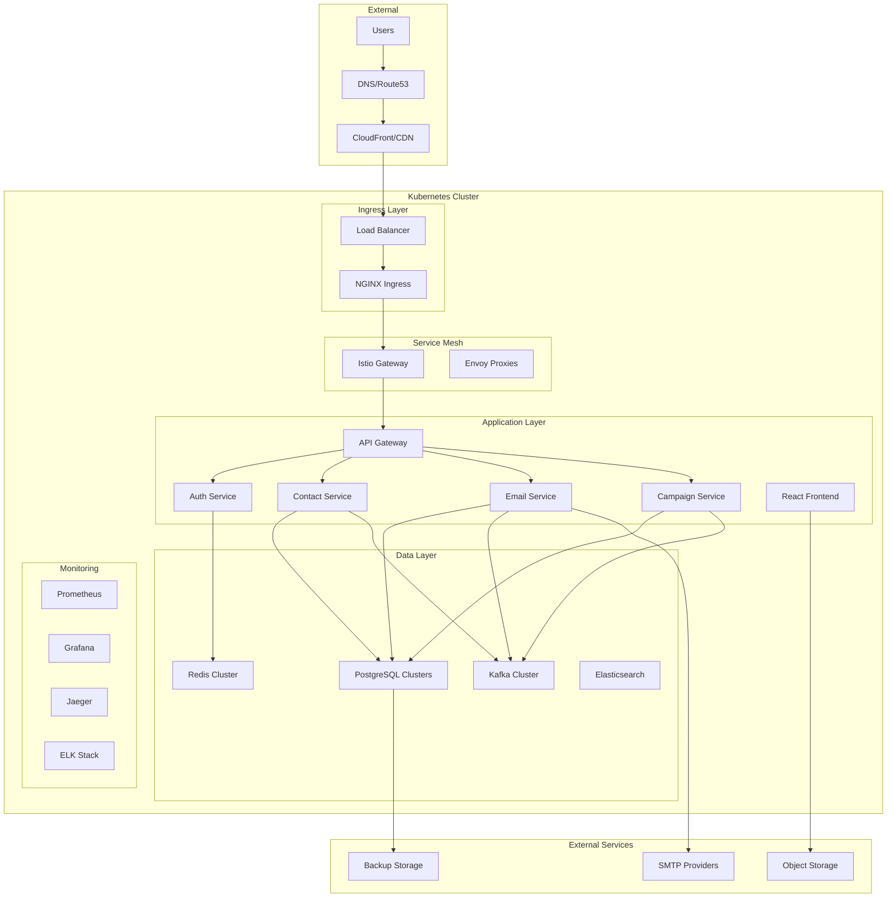

# Deployment Architecture

GripDay is designed for cloud-native deployment with Kubernetes as the primary orchestration platform. The deployment architecture supports multiple environments from local development to enterprise-scale production deployments.

## 🎯 Deployment Principles

### Core Principles

- **Cloud-Native**: Kubernetes-first design with container orchestration
- **Infrastructure as Code**: All infrastructure defined in version control
- **GitOps**: Automated deployment through Git-based workflows
- **Multi-Environment**: Consistent deployment across dev, staging, and production
- **Scalability**: Horizontal scaling with auto-scaling capabilities
- **Observability**: Comprehensive monitoring and logging

### Deployment Strategies

- **Blue-Green Deployment**: Zero-downtime deployments with instant rollback
- **Rolling Updates**: Gradual service updates with health checks
- **Canary Releases**: Gradual traffic shifting for risk mitigation
- **Feature Flags**: Runtime feature toggling without deployments

## 🏗️ Architecture Overview



## ☸️ Kubernetes Deployment

### Cluster Architecture

**Production Cluster Specifications:**

```yaml
# Cluster Configuration
apiVersion: v1
kind: ConfigMap
metadata:
  name: cluster-config
data:
  cluster-name: "gripday-production"
  region: "us-west-2"
  kubernetes-version: "1.28"
  node-groups: |
    - name: "system"
      instance-type: "m5.large"
      min-size: 3
      max-size: 6
      desired-size: 3
      labels:
        node-type: "system"
      taints:
        - key: "node-type"
          value: "system"
          effect: "NoSchedule"

    - name: "application"
      instance-type: "m5.xlarge"
      min-size: 3
      max-size: 20
      desired-size: 6
      labels:
        node-type: "application"

    - name: "data"
      instance-type: "r5.2xlarge"
      min-size: 3
      max-size: 9
      desired-size: 3
      labels:
        node-type: "data"
      taints:
        - key: "node-type"
          value: "data"
          effect: "NoSchedule"
```

### Namespace Strategy

```yaml
# Namespace Configuration
apiVersion: v1
kind: Namespace
metadata:
  name: gripday-system
  labels:
    name: gripday-system
    tier: infrastructure
---
apiVersion: v1
kind: Namespace
metadata:
  name: gripday-app
  labels:
    name: gripday-app
    tier: application
    istio-injection: enabled
---
apiVersion: v1
kind: Namespace
metadata:
  name: gripday-data
  labels:
    name: gripday-data
    tier: data
---
apiVersion: v1
kind: Namespace
metadata:
  name: gripday-monitoring
  labels:
    name: gripday-monitoring
    tier: monitoring
```

### Resource Management

**Resource Quotas:**

```yaml
apiVersion: v1
kind: ResourceQuota
metadata:
  name: gripday-app-quota
  namespace: gripday-app
spec:
  hard:
    requests.cpu: "20"
    requests.memory: 40Gi
    limits.cpu: "40"
    limits.memory: 80Gi
    persistentvolumeclaims: "20"
    services: "20"
    secrets: "50"
    configmaps: "50"

---
apiVersion: v1
kind: LimitRange
metadata:
  name: gripday-app-limits
  namespace: gripday-app
spec:
  limits:
    - default:
        cpu: "500m"
        memory: "1Gi"
      defaultRequest:
        cpu: "100m"
        memory: "256Mi"
      type: Container
```

## 🚀 Helm Charts

### Chart Structure

```
helm/
├── gripday-platform/
│   ├── Chart.yaml
│   ├── values.yaml
│   ├── values-dev.yaml
│   ├── values-staging.yaml
│   ├── values-production.yaml
│   └── templates/
│       ├── deployment.yaml
│       ├── service.yaml
│       ├── ingress.yaml
│       ├── configmap.yaml
│       ├── secret.yaml
│       ├── hpa.yaml
│       └── servicemonitor.yaml
├── gripday-infrastructure/
│   ├── Chart.yaml
│   ├── values.yaml
│   └── templates/
│       ├── postgresql.yaml
│       ├── redis.yaml
│       ├── kafka.yaml
│       └── elasticsearch.yaml
└── gripday-monitoring/
    ├── Chart.yaml
    ├── values.yaml
    └── templates/
        ├── prometheus.yaml
        ├── grafana.yaml
        └── jaeger.yaml
```

### Application Deployment Template

```yaml
# templates/deployment.yaml
apiVersion: apps/v1
kind: Deployment
metadata:
  name: {{ include "gripday.fullname" . }}-{{ .Values.service.name }}
  labels:
    {{- include "gripday.labels" . | nindent 4 }}
    app.kubernetes.io/component: {{ .Values.service.name }}
spec:
  replicas: {{ .Values.service.replicaCount }}
  selector:
    matchLabels:
      {{- include "gripday.selectorLabels" . | nindent 6 }}
      app.kubernetes.io/component: {{ .Values.service.name }}
  template:
    metadata:
      annotations:
        checksum/config: {{ include (print $.Template.BasePath "/configmap.yaml") . | sha256sum }}
        prometheus.io/scrape: "true"
        prometheus.io/port: "{{ .Values.service.port }}"
        prometheus.io/path: "/actuator/prometheus"
      labels:
        {{- include "gripday.selectorLabels" . | nindent 8 }}
        app.kubernetes.io/component: {{ .Values.service.name }}
        version: {{ .Values.image.tag | default .Chart.AppVersion }}
    spec:
      serviceAccountName: {{ include "gripday.serviceAccountName" . }}
      securityContext:
        {{- toYaml .Values.podSecurityContext | nindent 8 }}
      containers:
      - name: {{ .Values.service.name }}
        securityContext:
          {{- toYaml .Values.securityContext | nindent 12 }}
        image: "{{ .Values.image.repository }}/{{ .Values.service.name }}:{{ .Values.image.tag | default .Chart.AppVersion }}"
        imagePullPolicy: {{ .Values.image.pullPolicy }}
        ports:
        - name: http
          containerPort: {{ .Values.service.port }}
          protocol: TCP
        - name: management
          containerPort: {{ .Values.service.managementPort }}
          protocol: TCP
        env:
        - name: SPRING_PROFILES_ACTIVE
          value: {{ .Values.environment }}
        - name: SPRING_DATASOURCE_URL
          value: {{ .Values.database.url }}
        - name: SPRING_DATASOURCE_USERNAME
          valueFrom:
            secretKeyRef:
              name: {{ .Values.database.secretName }}
              key: username
        - name: SPRING_DATASOURCE_PASSWORD
          valueFrom:
            secretKeyRef:
              name: {{ .Values.database.secretName }}
              key: password
        - name: SPRING_KAFKA_BOOTSTRAP_SERVERS
          value: {{ .Values.kafka.bootstrapServers }}
        - name: SPRING_REDIS_HOST
          value: {{ .Values.redis.host }}
        - name: SPRING_REDIS_PORT
          value: "{{ .Values.redis.port }}"
        livenessProbe:
          httpGet:
            path: /actuator/health/liveness
            port: management
          initialDelaySeconds: 60
          periodSeconds: 30
          timeoutSeconds: 10
          failureThreshold: 3
        readinessProbe:
          httpGet:
            path: /actuator/health/readiness
            port: management
          initialDelaySeconds: 30
          periodSeconds: 10
          timeoutSeconds: 5
          failureThreshold: 3
        resources:
          {{- toYaml .Values.service.resources | nindent 12 }}
        volumeMounts:
        - name: config
          mountPath: /app/config
          readOnly: true
      volumes:
      - name: config
        configMap:
          name: {{ include "gripday.fullname" . }}-{{ .Values.service.name }}-config
      {{- with .Values.nodeSelector }}
      nodeSelector:
        {{- toYaml . | nindent 8 }}
      {{- end }}
      {{- with .Values.affinity }}
      affinity:
        {{- toYaml . | nindent 8 }}
      {{- end }}
      {{- with .Values.tolerations }}
      tolerations:
        {{- toYaml . | nindent 8 }}
      {{- end }}
```

### Values Configuration

```yaml
# values-production.yaml
global:
  environment: production
  imageRegistry: "registry.gripday.com"
  imageTag: "1.0.0"
  domain: "gripday.com"

services:
  apiGateway:
    enabled: true
    replicaCount: 3
    resources:
      requests:
        memory: "512Mi"
        cpu: "250m"
      limits:
        memory: "1Gi"
        cpu: "500m"
    autoscaling:
      enabled: true
      minReplicas: 3
      maxReplicas: 10
      targetCPUUtilizationPercentage: 70

  authService:
    enabled: true
    replicaCount: 2
    resources:
      requests:
        memory: "512Mi"
        cpu: "250m"
      limits:
        memory: "1Gi"
        cpu: "500m"

  contactService:
    enabled: true
    replicaCount: 3
    resources:
      requests:
        memory: "1Gi"
        cpu: "500m"
      limits:
        memory: "2Gi"
        cpu: "1000m"
    autoscaling:
      enabled: true
      minReplicas: 3
      maxReplicas: 15
      targetCPUUtilizationPercentage: 70

database:
  postgresql:
    enabled: true
    architecture: replication
    primary:
      persistence:
        size: 100Gi
        storageClass: "fast-ssd"
    readReplicas:
      replicaCount: 2
      persistence:
        size: 100Gi
        storageClass: "fast-ssd"

redis:
  enabled: true
  architecture: replication
  master:
    persistence:
      size: 20Gi
      storageClass: "fast-ssd"
  replica:
    replicaCount: 2
    persistence:
      size: 20Gi
      storageClass: "fast-ssd"

kafka:
  enabled: true
  replicaCount: 3
  persistence:
    size: 100Gi
    storageClass: "fast-ssd"

monitoring:
  prometheus:
    enabled: true
    retention: "30d"
    storage:
      size: 50Gi
      storageClass: "standard"
  grafana:
    enabled: true
    persistence:
      size: 10Gi
      storageClass: "standard"
  jaeger:
    enabled: true
    storage:
      type: elasticsearch

ingress:
  enabled: true
  className: "nginx"
  annotations:
    cert-manager.io/cluster-issuer: "letsencrypt-prod"
    nginx.ingress.kubernetes.io/rate-limit: "100"
    nginx.ingress.kubernetes.io/rate-limit-window: "1m"
  hosts:
    - host: api.gripday.com
      paths:
        - path: /
          pathType: Prefix
    - host: app.gripday.com
      paths:
        - path: /
          pathType: Prefix
  tls:
    - secretName: gripday-tls
      hosts:
        - api.gripday.com
        - app.gripday.com
```

## 🔄 GitOps with ArgoCD

### ArgoCD Application

```yaml
apiVersion: argoproj.io/v1alpha1
kind: Application
metadata:
  name: gripday-production
  namespace: argocd
spec:
  project: default
  source:
    repoURL: https://github.com/GripDay/gripday
    targetRevision: main
    path: helm/gripday-platform
    helm:
      valueFiles:
        - values-production.yaml
  destination:
    server: https://kubernetes.default.svc
    namespace: gripday-app
  syncPolicy:
    automated:
      prune: true
      selfHeal: true
      allowEmpty: false
    syncOptions:
      - CreateNamespace=true
      - PrunePropagationPolicy=foreground
      - PruneLast=true
    retry:
      limit: 5
      backoff:
        duration: 5s
        factor: 2
        maxDuration: 3m
  revisionHistoryLimit: 10
```

### Multi-Environment Strategy

```yaml
# Application Set for multiple environments
apiVersion: argoproj.io/v1alpha1
kind: ApplicationSet
metadata:
  name: gripday-environments
  namespace: argocd
spec:
  generators:
    - list:
        elements:
          - cluster: development
            url: https://gripday.org
            values: values-dev.yaml
            namespace: gripday-dev
          - cluster: staging
            url: https://gripday.space
            values: values-staging.yaml
            namespace: gripday-staging
          - cluster: production
            url: https://gripday.com
            values: values-production.yaml
            namespace: gripday-app
  template:
    metadata:
      name: "gripday-{{cluster}}"
    spec:
      project: default
      source:
        repoURL: https://github.com/GripDay/gripday
        targetRevision: dev
        path: helm/gripday-platform
        helm:
          valueFiles:
            - "{{values}}"
      destination:
        server: "{{url}}"
        namespace: "{{namespace}}"
      syncPolicy:
        automated:
          prune: true
          selfHeal: true
```

## 🌐 Multi-Cloud Deployment

### AWS EKS Deployment

```yaml
# EKS Cluster Configuration
apiVersion: eksctl.io/v1alpha5
kind: ClusterConfig

metadata:
  name: gripday-production
  region: us-west-2
  version: "1.28"

iam:
  withOIDC: true

managedNodeGroups:
  - name: system-nodes
    instanceType: m5.large
    minSize: 3
    maxSize: 6
    desiredCapacity: 3
    labels:
      node-type: system
    taints:
      - key: node-type
        value: system
        effect: NoSchedule
    iam:
      attachPolicyARNs:
        - arn:aws:iam::aws:policy/AmazonEKSWorkerNodePolicy
        - arn:aws:iam::aws:policy/AmazonEKS_CNI_Policy
        - arn:aws:iam::aws:policy/AmazonEC2ContainerRegistryReadOnly

  - name: app-nodes
    instanceType: m5.xlarge
    minSize: 3
    maxSize: 20
    desiredCapacity: 6
    labels:
      node-type: application
    iam:
      attachPolicyARNs:
        - arn:aws:iam::aws:policy/AmazonEKSWorkerNodePolicy
        - arn:aws:iam::aws:policy/AmazonEKS_CNI_Policy
        - arn:aws:iam::aws:policy/AmazonEC2ContainerRegistryReadOnly

addons:
  - name: vpc-cni
  - name: coredns
  - name: kube-proxy
  - name: aws-ebs-csi-driver

cloudWatch:
  clusterLogging:
    enableTypes: ["*"]
```

### Google GKE Deployment

```yaml
# GKE Cluster Configuration
apiVersion: container.cnrm.cloud.google.com/v1beta1
kind: ContainerCluster
metadata:
  name: gripday-production
  namespace: gripday-system
spec:
  location: us-central1
  initialNodeCount: 1
  removeDefaultNodePool: true

  workloadIdentityConfig:
    workloadPool: PROJECT_ID.svc.id.goog

  addonsConfig:
    httpLoadBalancing:
      disabled: false
    horizontalPodAutoscaling:
      disabled: false
    networkPolicyConfig:
      disabled: false

---
apiVersion: container.cnrm.cloud.google.com/v1beta1
kind: ContainerNodePool
metadata:
  name: gripday-app-pool
  namespace: gripday-system
spec:
  location: us-central1
  clusterRef:
    name: gripday-production

  nodeCount: 3

  nodeConfig:
    machineType: n1-standard-4
    diskSizeGb: 100
    diskType: pd-ssd

    oauthScopes:
      - https://www.googleapis.com/auth/cloud-platform

    labels:
      node-type: application

  autoscaling:
    enabled: true
    minNodeCount: 3
    maxNodeCount: 20

  management:
    autoRepair: true
    autoUpgrade: true
```

## 📊 Monitoring and Observability

### Prometheus Configuration

```yaml
apiVersion: monitoring.coreos.com/v1
kind: Prometheus
metadata:
  name: gripday-prometheus
  namespace: gripday-monitoring
spec:
  serviceAccountName: prometheus
  serviceMonitorSelector:
    matchLabels:
      app: gripday
  ruleSelector:
    matchLabels:
      app: gripday
  resources:
    requests:
      memory: 2Gi
      cpu: 1000m
    limits:
      memory: 4Gi
      cpu: 2000m
  retention: 30d
  storage:
    volumeClaimTemplate:
      spec:
        storageClassName: fast-ssd
        resources:
          requests:
            storage: 50Gi
  alerting:
    alertmanagers:
      - namespace: gripday-monitoring
        name: alertmanager-main
        port: web
```

### Service Monitor

```yaml
apiVersion: monitoring.coreos.com/v1
kind: ServiceMonitor
metadata:
  name: gripday-services
  namespace: gripday-monitoring
  labels:
    app: gripday
spec:
  selector:
    matchLabels:
      app: gripday
  endpoints:
    - port: management
      path: /actuator/prometheus
      interval: 30s
      scrapeTimeout: 10s
  namespaceSelector:
    matchNames:
      - gripday-app
```

### Grafana Dashboard

```yaml
apiVersion: v1
kind: ConfigMap
metadata:
  name: gripday-dashboard
  namespace: gripday-monitoring
data:
  dashboard.json: |
    {
      "dashboard": {
        "title": "GripDay Application Metrics",
        "panels": [
          {
            "title": "Request Rate",
            "type": "graph",
            "targets": [
              {
                "expr": "sum(rate(http_requests_total{job=\"gripday-services\"}[5m])) by (service)",
                "legendFormat": "{{service}}"
              }
            ]
          },
          {
            "title": "Response Time",
            "type": "graph",
            "targets": [
              {
                "expr": "histogram_quantile(0.95, sum(rate(http_request_duration_seconds_bucket{job=\"gripday-services\"}[5m])) by (le, service))",
                "legendFormat": "{{service}} 95th percentile"
              }
            ]
          },
          {
            "title": "Error Rate",
            "type": "graph",
            "targets": [
              {
                "expr": "sum(rate(http_requests_total{job=\"gripday-services\",status=~\"5..\"}[5m])) by (service) / sum(rate(http_requests_total{job=\"gripday-services\"}[5m])) by (service)",
                "legendFormat": "{{service}} error rate"
              }
            ]
          }
        ]
      }
    }
```

## 🔒 Security Configuration

### Pod Security Standards

```yaml
apiVersion: v1
kind: Namespace
metadata:
  name: gripday-app
  labels:
    pod-security.kubernetes.io/enforce: restricted
    pod-security.kubernetes.io/audit: restricted
    pod-security.kubernetes.io/warn: restricted
```

### Network Policies

```yaml
apiVersion: networking.k8s.io/v1
kind: NetworkPolicy
metadata:
  name: gripday-app-netpol
  namespace: gripday-app
spec:
  podSelector: {}
  policyTypes:
    - Ingress
    - Egress
  ingress:
    - from:
        - namespaceSelector:
            matchLabels:
              name: istio-system
        - namespaceSelector:
            matchLabels:
              name: gripday-app
      ports:
        - protocol: TCP
          port: 8080
  egress:
    - to:
        - namespaceSelector:
            matchLabels:
              name: gripday-data
      ports:
        - protocol: TCP
          port: 5432
        - protocol: TCP
          port: 6379
        - protocol: TCP
          port: 9092
    - to: []
      ports:
        - protocol: TCP
          port: 443
        - protocol: TCP
          port: 53
        - protocol: UDP
          port: 53
```

## 🚀 Scaling and Performance

### Horizontal Pod Autoscaler

```yaml
apiVersion: autoscaling/v2
kind: HorizontalPodAutoscaler
metadata:
  name: contact-service-hpa
  namespace: gripday-app
spec:
  scaleTargetRef:
    apiVersion: apps/v1
    kind: Deployment
    name: contact-service
  minReplicas: 3
  maxReplicas: 15
  metrics:
    - type: Resource
      resource:
        name: cpu
        target:
          type: Utilization
          averageUtilization: 70
    - type: Resource
      resource:
        name: memory
        target:
          type: Utilization
          averageUtilization: 80
    - type: Pods
      pods:
        metric:
          name: http_requests_per_second
        target:
          type: AverageValue
          averageValue: "100"
  behavior:
    scaleDown:
      stabilizationWindowSeconds: 300
      policies:
        - type: Percent
          value: 10
          periodSeconds: 60
    scaleUp:
      stabilizationWindowSeconds: 60
      policies:
        - type: Percent
          value: 50
          periodSeconds: 60
```

### Vertical Pod Autoscaler

```yaml
apiVersion: autoscaling.k8s.io/v1
kind: VerticalPodAutoscaler
metadata:
  name: contact-service-vpa
  namespace: gripday-app
spec:
  targetRef:
    apiVersion: apps/v1
    kind: Deployment
    name: contact-service
  updatePolicy:
    updateMode: "Auto"
  resourcePolicy:
    containerPolicies:
      - containerName: contact-service
        minAllowed:
          cpu: 100m
          memory: 256Mi
        maxAllowed:
          cpu: 2000m
          memory: 4Gi
        controlledResources: ["cpu", "memory"]
```

## 📋 Deployment Checklist

### Pre-Deployment

- [ ] Infrastructure provisioned and configured
- [ ] Kubernetes cluster ready with required operators
- [ ] Container images built and pushed to registry
- [ ] Secrets and ConfigMaps created
- [ ] Database schemas migrated
- [ ] Monitoring and logging configured

### Deployment

- [ ] Helm charts validated and tested
- [ ] ArgoCD applications configured
- [ ] Services deployed in correct order
- [ ] Health checks passing
- [ ] Ingress and DNS configured
- [ ] SSL certificates provisioned

### Post-Deployment

- [ ] Application functionality verified
- [ ] Performance tests executed
- [ ] Security scans completed
- [ ] Monitoring alerts configured
- [ ] Backup procedures tested
- [ ] Documentation updated

### Production Readiness

- [ ] Load testing completed
- [ ] Disaster recovery tested
- [ ] Security audit passed
- [ ] Compliance requirements met
- [ ] Support procedures documented
- [ ] Team training completed

---

_This deployment architecture ensures GripDay can be deployed reliably and securely across multiple environments while maintaining high availability and performance._
