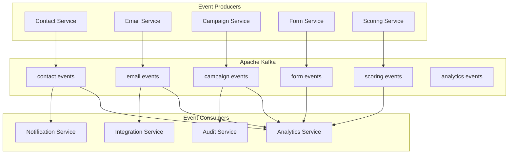

# Event-Driven Architecture

GripDay implements a comprehensive event-driven architecture using Apache Kafka to enable real-time, scalable, and loosely coupled communication between microservices. This architecture supports complex B2B marketing automation workflows while maintaining system resilience and performance.

## 🎯 Event-Driven Principles

### Core Principles

- **Asynchronous Communication**: Non-blocking service interactions
- **Event Sourcing**: Complete audit trail with event replay capabilities
- **CQRS Pattern**: Command Query Responsibility Segregation
- **Eventual Consistency**: Distributed data consistency through events
- **Loose Coupling**: Services communicate through well-defined events
- **Scalability**: Independent scaling of event producers and consumers

### Benefits

- **Real-time Processing**: Immediate response to business events
- **System Resilience**: Fault tolerance through event persistence
- **Audit Trail**: Complete history of all system changes
- **Integration**: Easy integration with external systems
- **Scalability**: Horizontal scaling of event processing

## 📡 Event Architecture Overview



## 🔄 Event Types and Schemas

### Domain Events

#### Contact Events

```java
// Base event class
@JsonTypeInfo(use = JsonTypeInfo.Id.NAME, property = "eventType")
@JsonSubTypes({
    @JsonSubTypes.Type(value = ContactCreatedEvent.class, name = "CONTACT_CREATED"),
    @JsonSubTypes.Type(value = ContactUpdatedEvent.class, name = "CONTACT_UPDATED"),
    @JsonSubTypes.Type(value = ContactDeletedEvent.class, name = "CONTACT_DELETED")
})
public abstract class ContactEvent extends DomainEvent {
    private Long contactId;
    private String tenantId;
}

@Data
@EqualsAndHashCode(callSuper = true)
public class ContactCreatedEvent extends ContactEvent {
    private String firstName;
    private String lastName;
    private String email;
    private String phone;
    private Long companyId;
    private String leadSource;

    public static ContactCreatedEvent from(Contact contact) {
        return ContactCreatedEvent.builder()
            .contactId(contact.getId())
            .tenantId(contact.getTenantId())
            .firstName(contact.getFirstName())
            .lastName(contact.getLastName())
            .email(contact.getEmail())
            .phone(contact.getPhone())
            .companyId(contact.getCompany() != null ? contact.getCompany().getId() : null)
            .leadSource(contact.getLeadSource())
            .timestamp(Instant.now())
            .build();
    }
}

@Data
@EqualsAndHashCode(callSuper = true)
public class ContactUpdatedEvent extends ContactEvent {
    private Map<String, Object> previousValues;
    private Map<String, Object> newValues;
    private List<String> changedFields;
}
```

#### Email Events

```java
@Data
@EqualsAndHashCode(callSuper = true)
public class EmailSentEvent extends DomainEvent {
    private Long emailId;
    private Long campaignId;
    private Long contactId;
    private String emailAddress;
    private String subject;
    private String templateId;
    private String smtpProvider;
    private String messageId;
    private String tenantId;
}

@Data
@EqualsAndHashCode(callSuper = true)
public class EmailOpenedEvent extends DomainEvent {
    private Long emailId;
    private Long contactId;
    private String ipAddress;
    private String userAgent;
    private String tenantId;
}

@Data
@EqualsAndHashCode(callSuper = true)
public class EmailClickedEvent extends DomainEvent {
    private Long emailId;
    private Long contactId;
    private String clickedUrl;
    private String ipAddress;
    private String userAgent;
    private String tenantId;
}
```

#### Campaign Events

```java
@Data
@EqualsAndHashCode(callSuper = true)
public class CampaignStartedEvent extends DomainEvent {
    private Long campaignId;
    private String campaignName;
    private String campaignType;
    private Integer totalContacts;
    private String tenantId;
}

@Data
@EqualsAndHashCode(callSuper = true)
public class CampaignStepExecutedEvent extends DomainEvent {
    private Long campaignId;
    private Long executionId;
    private Long contactId;
    private String stepId;
    private String stepType;
    private String status;
    private Map<String, Object> stepData;
    private String tenantId;
}
```

### Event Schema Registry

**Avro Schema Definition:**

```json
{
  "type": "record",
  "name": "ContactCreatedEvent",
  "namespace": "com.gripday.events.contact",
  "fields": [
    { "name": "eventId", "type": "string" },
    { "name": "eventType", "type": "string" },
    { "name": "timestamp", "type": "long" },
    { "name": "version", "type": "string" },
    { "name": "contactId", "type": "long" },
    { "name": "tenantId", "type": "string" },
    { "name": "firstName", "type": "string" },
    { "name": "lastName", "type": "string" },
    { "name": "email", "type": "string" },
    { "name": "phone", "type": ["null", "string"], "default": null },
    { "name": "companyId", "type": ["null", "long"], "default": null },
    { "name": "leadSource", "type": ["null", "string"], "default": null }
  ]
}
```

## 🚀 Event Publishing

### Event Publisher Implementation

```java
@Component
@Slf4j
public class EventPublisher {

    private final KafkaTemplate<String, Object> kafkaTemplate;
    private final EventStore eventStore;
    private final MeterRegistry meterRegistry;

    public EventPublisher(KafkaTemplate<String, Object> kafkaTemplate,
                         EventStore eventStore,
                         MeterRegistry meterRegistry) {
        this.kafkaTemplate = kafkaTemplate;
        this.eventStore = eventStore;
        this.meterRegistry = meterRegistry;
    }

    @Async
    public CompletableFuture<Void> publishEvent(DomainEvent event) {
        try {
            // Store event for audit and replay
            eventStore.saveEvent(event);

            // Determine topic based on event type
            String topic = getTopicForEvent(event);

            // Create partition key for ordering
            String partitionKey = getPartitionKey(event);

            // Publish to Kafka
            ListenableFuture<SendResult<String, Object>> future =
                kafkaTemplate.send(topic, partitionKey, event);

            future.addCallback(
                result -> {
                    log.debug("Event published successfully: {}", event.getEventId());
                    recordMetric("event.published.success", event);
                },
                failure -> {
                    log.error("Failed to publish event: {}", event.getEventId(), failure);
                    recordMetric("event.published.failure", event);
                    handlePublishFailure(event, failure);
                }
            );

            return CompletableFuture.completedFuture(null);

        } catch (Exception e) {
            log.error("Error publishing event: {}", event.getEventId(), e);
            recordMetric("event.published.error", event);
            return CompletableFuture.failedFuture(e);
        }
    }

    private String getTopicForEvent(DomainEvent event) {
        String eventType = event.getClass().getSimpleName();

        if (eventType.startsWith("Contact")) {
            return "contact.events";
        } else if (eventType.startsWith("Email")) {
            return "email.events";
        } else if (eventType.startsWith("Campaign")) {
            return "campaign.events";
        } else if (eventType.startsWith("Form")) {
            return "form.events";
        } else if (eventType.startsWith("Scoring")) {
            return "scoring.events";
        }

        return "general.events";
    }

    private String getPartitionKey(DomainEvent event) {
        // Use tenant ID for partitioning to ensure tenant isolation
        return event.getTenantId();
    }
}
```

### Transactional Event Publishing

```java
@Service
@Transactional
public class ContactService {

    private final ContactRepository contactRepository;
    private final EventPublisher eventPublisher;

    public ContactDto createContact(CreateContactRequest request) {
        // Create contact entity
        Contact contact = Contact.builder()
            .firstName(request.getFirstName())
            .lastName(request.getLastName())
            .email(request.getEmail())
            .tenantId(TenantContext.getTenantId())
            .build();

        // Save to database
        Contact savedContact = contactRepository.save(contact);

        // Publish event within same transaction
        ContactCreatedEvent event = ContactCreatedEvent.from(savedContact);
        eventPublisher.publishEvent(event);

        return ContactDto.from(savedContact);
    }
}
```

## 📥 Event Consumption

### Event Consumer Implementation

```java
@Component
@Slf4j
public class ContactEventConsumer {

    private final AnalyticsService analyticsService;
    private final NotificationService notificationService;
    private final IntegrationService integrationService;

    @KafkaListener(
        topics = "contact.events",
        groupId = "analytics-service",
        containerFactory = "kafkaListenerContainerFactory"
    )
    public void handleContactEvent(ContactEvent event) {
        try {
            log.debug("Processing contact event: {}", event.getEventId());

            // Set tenant context
            TenantContext.setTenantId(event.getTenantId());

            switch (event.getEventType()) {
                case "CONTACT_CREATED":
                    handleContactCreated((ContactCreatedEvent) event);
                    break;
                case "CONTACT_UPDATED":
                    handleContactUpdated((ContactUpdatedEvent) event);
                    break;
                case "CONTACT_DELETED":
                    handleContactDeleted((ContactDeletedEvent) event);
                    break;
                default:
                    log.warn("Unknown contact event type: {}", event.getEventType());
            }

        } catch (Exception e) {
            log.error("Error processing contact event: {}", event.getEventId(), e);
            throw e; // Trigger retry mechanism
        } finally {
            TenantContext.clear();
        }
    }

    private void handleContactCreated(ContactCreatedEvent event) {
        // Update analytics
        analyticsService.recordContactCreated(event);

        // Send welcome notification
        notificationService.sendWelcomeNotification(event.getContactId());

        // Sync with external CRM
        integrationService.syncContactToExternalSystems(event);

        // Trigger welcome campaign
        campaignService.triggerWelcomeCampaign(event.getContactId());
    }
}
```

### Error Handling and Retry

```java
@Configuration
public class KafkaConsumerConfig {

    @Bean
    public ConcurrentKafkaListenerContainerFactory<String, Object> kafkaListenerContainerFactory() {
        ConcurrentKafkaListenerContainerFactory<String, Object> factory =
            new ConcurrentKafkaListenerContainerFactory<>();

        factory.setConsumerFactory(consumerFactory());
        factory.setConcurrency(3);

        // Error handling
        factory.setErrorHandler(new SeekToCurrentErrorHandler(
            new FixedBackOff(1000L, 3L))); // Retry 3 times with 1 second delay

        // Dead letter topic
        factory.setErrorHandler(new SeekToCurrentErrorHandler(
            new DeadLetterPublishingRecoverer(kafkaTemplate())));

        return factory;
    }

    @Bean
    public RetryTemplate retryTemplate() {
        RetryTemplate retryTemplate = new RetryTemplate();

        FixedBackOffPolicy backOffPolicy = new FixedBackOffPolicy();
        backOffPolicy.setBackOffPeriod(2000L);
        retryTemplate.setBackOffPolicy(backOffPolicy);

        SimpleRetryPolicy retryPolicy = new SimpleRetryPolicy();
        retryPolicy.setMaxAttempts(3);
        retryTemplate.setRetryPolicy(retryPolicy);

        return retryTemplate;
    }
}
```

## 🔄 Event Sourcing

### Event Store Implementation

```java
@Entity
@Table(name = "event_store")
public class EventStoreEntry {
    @Id
    private String eventId;

    @Column(name = "aggregate_id")
    private String aggregateId;

    @Column(name = "aggregate_type")
    private String aggregateType;

    @Column(name = "event_type")
    private String eventType;

    @Column(name = "event_data", columnDefinition = "TEXT")
    private String eventData;

    @Column(name = "event_version")
    private Integer eventVersion;

    @Column(name = "tenant_id")
    private String tenantId;

    @Column(name = "created_at")
    private Instant createdAt;

    @Column(name = "created_by")
    private String createdBy;
}

@Service
public class EventStore {

    private final EventStoreRepository eventStoreRepository;
    private final ObjectMapper objectMapper;

    public void saveEvent(DomainEvent event) {
        try {
            EventStoreEntry entry = EventStoreEntry.builder()
                .eventId(event.getEventId())
                .aggregateId(event.getAggregateId())
                .aggregateType(event.getAggregateType())
                .eventType(event.getEventType())
                .eventData(objectMapper.writeValueAsString(event))
                .eventVersion(event.getVersion())
                .tenantId(event.getTenantId())
                .createdAt(event.getTimestamp())
                .createdBy(event.getCreatedBy())
                .build();

            eventStoreRepository.save(entry);

        } catch (Exception e) {
            log.error("Failed to save event to event store: {}", event.getEventId(), e);
            throw new EventStoreException("Failed to save event", e);
        }
    }

    public List<DomainEvent> getEventsForAggregate(String aggregateId, String aggregateType) {
        List<EventStoreEntry> entries = eventStoreRepository
            .findByAggregateIdAndAggregateTypeOrderByEventVersionAsc(aggregateId, aggregateType);

        return entries.stream()
            .map(this::deserializeEvent)
            .collect(Collectors.toList());
    }

    public List<DomainEvent> getEventsByType(String eventType, Instant fromTimestamp) {
        List<EventStoreEntry> entries = eventStoreRepository
            .findByEventTypeAndCreatedAtAfterOrderByCreatedAtAsc(eventType, fromTimestamp);

        return entries.stream()
            .map(this::deserializeEvent)
            .collect(Collectors.toList());
    }
}
```

### Event Replay Capability

```java
@Service
public class EventReplayService {

    private final EventStore eventStore;
    private final EventPublisher eventPublisher;

    public void replayEvents(String aggregateId, String aggregateType) {
        List<DomainEvent> events = eventStore.getEventsForAggregate(aggregateId, aggregateType);

        events.forEach(event -> {
            log.info("Replaying event: {} for aggregate: {}", event.getEventId(), aggregateId);
            eventPublisher.publishEvent(event);
        });
    }

    public void replayEventsByType(String eventType, Instant fromTimestamp) {
        List<DomainEvent> events = eventStore.getEventsByType(eventType, fromTimestamp);

        events.forEach(event -> {
            log.info("Replaying event: {} of type: {}", event.getEventId(), eventType);
            eventPublisher.publishEvent(event);
        });
    }

    public void rebuildProjection(String projectionName, Instant fromTimestamp) {
        // Clear existing projection
        projectionService.clearProjection(projectionName);

        // Replay all relevant events
        List<String> relevantEventTypes = getRelevantEventTypes(projectionName);

        relevantEventTypes.forEach(eventType -> {
            replayEventsByType(eventType, fromTimestamp);
        });
    }
}
```

## 📊 Event Analytics and Monitoring

### Event Metrics

```java
@Component
public class EventMetrics {

    private final MeterRegistry meterRegistry;
    private final Counter eventsPublished;
    private final Counter eventsConsumed;
    private final Timer eventProcessingTime;

    public EventMetrics(MeterRegistry meterRegistry) {
        this.meterRegistry = meterRegistry;
        this.eventsPublished = Counter.builder("events.published")
            .description("Number of events published")
            .register(meterRegistry);
        this.eventsConsumed = Counter.builder("events.consumed")
            .description("Number of events consumed")
            .register(meterRegistry);
        this.eventProcessingTime = Timer.builder("events.processing.time")
            .description("Event processing time")
            .register(meterRegistry);
    }

    public void recordEventPublished(String eventType, String tenantId) {
        eventsPublished.increment(
            Tags.of(
                "event_type", eventType,
                "tenant_id", tenantId
            )
        );
    }

    public void recordEventConsumed(String eventType, String consumer, String tenantId) {
        eventsConsumed.increment(
            Tags.of(
                "event_type", eventType,
                "consumer", consumer,
                "tenant_id", tenantId
            )
        );
    }

    public Timer.Sample startProcessingTimer() {
        return Timer.start(meterRegistry);
    }

    public void recordProcessingTime(Timer.Sample sample, String eventType, String consumer) {
        sample.stop(Timer.builder("events.processing.time")
            .tag("event_type", eventType)
            .tag("consumer", consumer)
            .register(meterRegistry));
    }
}
```

### Event Monitoring Dashboard

```yaml
# Grafana Dashboard Configuration
apiVersion: v1
kind: ConfigMap
metadata:
  name: event-monitoring-dashboard
data:
  dashboard.json: |
    {
      "dashboard": {
        "title": "GripDay Event Monitoring",
        "panels": [
          {
            "title": "Events Published per Second",
            "type": "graph",
            "targets": [
              {
                "expr": "rate(events_published_total[5m])",
                "legendFormat": "{{event_type}}"
              }
            ]
          },
          {
            "title": "Event Processing Time",
            "type": "graph",
            "targets": [
              {
                "expr": "histogram_quantile(0.95, rate(events_processing_time_seconds_bucket[5m]))",
                "legendFormat": "95th percentile"
              }
            ]
          },
          {
            "title": "Event Consumer Lag",
            "type": "graph",
            "targets": [
              {
                "expr": "kafka_consumer_lag_sum",
                "legendFormat": "{{consumer_group}}"
              }
            ]
          }
        ]
      }
    }
```

## 🔧 Event Configuration

### Kafka Configuration

```yaml
# Kafka Cluster Configuration
apiVersion: kafka.strimzi.io/v1beta2
kind: Kafka
metadata:
  name: gripday-kafka
spec:
  kafka:
    version: 3.5.0
    replicas: 3
    listeners:
      - name: plain
        port: 9092
        type: internal
        tls: false
      - name: tls
        port: 9093
        type: internal
        tls: true
    config:
      offsets.topic.replication.factor: 3
      transaction.state.log.replication.factor: 3
      transaction.state.log.min.isr: 2
      default.replication.factor: 3
      min.insync.replicas: 2
      inter.broker.protocol.version: "3.5"
      log.retention.hours: 168
      log.segment.bytes: 1073741824
      log.retention.check.interval.ms: 300000
      num.partitions: 12
    storage:
      type: jbod
      volumes:
        - id: 0
          type: persistent-claim
          size: 100Gi
          deleteClaim: false
  zookeeper:
    replicas: 3
    storage:
      type: persistent-claim
      size: 10Gi
      deleteClaim: false
  entityOperator:
    topicOperator: {}
    userOperator: {}
```

### Topic Configuration

```yaml
# Contact Events Topic
apiVersion: kafka.strimzi.io/v1beta2
kind: KafkaTopic
metadata:
  name: contact-events
  labels:
    strimzi.io/cluster: gripday-kafka
spec:
  partitions: 12
  replicas: 3
  config:
    retention.ms: 604800000 # 7 days
    segment.ms: 86400000 # 1 day
    cleanup.policy: delete
    compression.type: snappy

---
# Email Events Topic
apiVersion: kafka.strimzi.io/v1beta2
kind: KafkaTopic
metadata:
  name: email-events
  labels:
    strimzi.io/cluster: gripday-kafka
spec:
  partitions: 12
  replicas: 3
  config:
    retention.ms: 2592000000 # 30 days
    segment.ms: 86400000 # 1 day
    cleanup.policy: delete
    compression.type: snappy
```

## 🚀 Best Practices

### Event Design

- **Immutable Events**: Events should never be modified after creation
- **Self-Contained**: Events should contain all necessary information
- **Versioned**: Support event schema evolution with versioning
- **Idempotent**: Event processing should be idempotent
- **Ordered**: Maintain event ordering within partitions

### Performance Optimization

- **Batching**: Use batch processing for high-throughput scenarios
- **Partitioning**: Distribute events across partitions for parallel processing
- **Compression**: Use compression to reduce network overhead
- **Async Processing**: Process events asynchronously when possible
- **Connection Pooling**: Reuse Kafka connections for efficiency

### Error Handling

- **Retry Logic**: Implement exponential backoff for transient failures
- **Dead Letter Queues**: Handle permanently failed messages
- **Circuit Breakers**: Prevent cascade failures
- **Monitoring**: Monitor event processing health and performance
- **Alerting**: Alert on processing failures and delays

### Security

- **Encryption**: Encrypt sensitive event data
- **Authentication**: Secure Kafka cluster access
- **Authorization**: Control topic access permissions
- **Audit**: Log all event processing activities
- **Tenant Isolation**: Ensure events are properly isolated by tenant

---

_This event-driven architecture enables GripDay to process complex B2B marketing workflows in real-time while maintaining system resilience and scalability._
