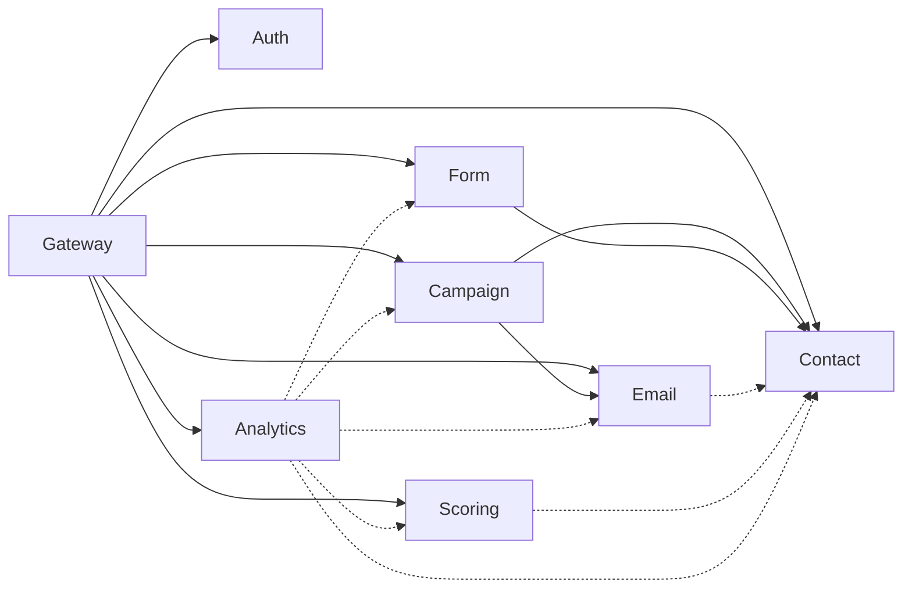

# Microservices Architecture

GripDay implements a **domain-driven microservices architecture** with 8 core services designed for enterprise-scale B2B marketing automation. Each service is independently deployable, scalable, and maintainable.

## 🏗️ Service Overview

### Core Microservices (MVP Phase 1)

| Service                    | Port | Database           | Primary Responsibility                   |
| -------------------------- | ---- | ------------------ | ---------------------------------------- |
| **API Gateway**            | 8080 | Redis              | Service orchestration, routing, security |
| **Authentication Service** | 8081 | PostgreSQL         | User management, JWT auth, RBAC          |
| **Contact Management**     | 8082 | PostgreSQL         | Contact/company lifecycle, segmentation  |
| **Email Marketing**        | 8083 | PostgreSQL         | Email creation, delivery, tracking       |
| **Campaign Automation**    | 8084 | PostgreSQL         | Workflow engine, automation              |
| **Form Builder**           | 8085 | PostgreSQL         | Form creation, submission processing     |
| **Scoring Service**        | 8086 | PostgreSQL         | Lead scoring, qualification              |
| **Analytics Service**      | 8087 | PostgreSQL + Redis | Reporting, business intelligence         |

## 🔐 Authentication Service

### Responsibilities

- **User Lifecycle Management**: Registration, authentication, profile management
- **JWT Token Management**: Creation, validation, refresh, revocation
- **Role-Based Access Control**: Granular permissions and role management
- **Security Audit**: Comprehensive audit trails and security monitoring
- **Service-to-Service Auth**: JWT propagation between microservices

### Technology Stack

- **Framework**: Spring Boot 3 with Spring Security 6
- **Database**: PostgreSQL with Flyway migrations
- **Authentication**: JWT with BCrypt password hashing
- **Caching**: Redis for session management and token blacklisting

### API Endpoints

```
POST   /api/v1/auth/register     - User registration
POST   /api/v1/auth/login        - User authentication
POST   /api/v1/auth/refresh      - Token refresh
POST   /api/v1/auth/logout       - User logout
GET    /api/v1/auth/profile      - User profile
PUT    /api/v1/auth/profile      - Update profile
GET    /api/v1/auth/permissions  - User permissions
```

### Core Implementation

```java
@RestController
@RequestMapping("/api/v1/auth")
public class AuthController {

    @PostMapping("/login")
    public ResponseEntity<AuthResponse> authenticate(@Valid @RequestBody LoginRequest request) {
        Authentication authentication = authenticationManager.authenticate(
            new UsernamePasswordAuthenticationToken(request.getUsername(), request.getPassword())
        );

        UserPrincipal userPrincipal = (UserPrincipal) authentication.getPrincipal();
        String jwt = jwtTokenProvider.generateToken(userPrincipal);

        return ResponseEntity.ok(AuthResponse.builder()
            .accessToken(jwt)
            .tokenType("Bearer")
            .user(UserDto.from(userPrincipal.getUser()))
            .build());
    }
}
```

### Database Schema

```sql
-- Core user management
CREATE TABLE users (
    id BIGSERIAL PRIMARY KEY,
    username VARCHAR(50) UNIQUE NOT NULL,
    email VARCHAR(100) UNIQUE NOT NULL,
    password_hash VARCHAR(255) NOT NULL,
    tenant_id VARCHAR(50) NOT NULL,
    active BOOLEAN DEFAULT true,
    created_at TIMESTAMP DEFAULT CURRENT_TIMESTAMP,
    updated_at TIMESTAMP DEFAULT CURRENT_TIMESTAMP
);

-- Role-based access control
CREATE TABLE roles (
    id BIGSERIAL PRIMARY KEY,
    name VARCHAR(50) UNIQUE NOT NULL,
    description TEXT
);

CREATE TABLE permissions (
    id BIGSERIAL PRIMARY KEY,
    name VARCHAR(100) UNIQUE NOT NULL,
    resource VARCHAR(50) NOT NULL,
    action VARCHAR(50) NOT NULL
);

CREATE TABLE user_roles (
    user_id BIGINT REFERENCES users(id),
    role_id BIGINT REFERENCES roles(id),
    PRIMARY KEY (user_id, role_id)
);

CREATE TABLE role_permissions (
    role_id BIGINT REFERENCES roles(id),
    permission_id BIGINT REFERENCES permissions(id),
    PRIMARY KEY (role_id, permission_id)
);
```

## 👤 Contact Management Service

### Responsibilities

- **Contact Lifecycle**: CRUD operations, validation, deduplication
- **Company Management**: Account-based marketing with company relationships
- **Advanced Search**: Elasticsearch integration for complex queries
- **Segmentation**: Dynamic and static contact segments
- **Import/Export**: CSV processing with validation and error handling
- **Activity Tracking**: Contact behavior and interaction history

### Technology Stack

- **Framework**: Spring Boot 3 with Spring Data JPA
- **Database**: PostgreSQL with advanced indexing
- **Search**: Elasticsearch for full-text search and analytics
- **Events**: Kafka for contact lifecycle events
- **Validation**: Bean Validation with custom validators

### API Endpoints

```
GET    /api/v1/contacts              - List contacts with filtering
POST   /api/v1/contacts              - Create contact
GET    /api/v1/contacts/{id}         - Get contact details
PUT    /api/v1/contacts/{id}         - Update contact
DELETE /api/v1/contacts/{id}         - Delete contact
POST   /api/v1/contacts/import       - Bulk import contacts
GET    /api/v1/contacts/export       - Export contacts
GET    /api/v1/contacts/search       - Advanced search
POST   /api/v1/contacts/segments     - Create segment
GET    /api/v1/contacts/segments     - List segments
```

### Core Entities

```java
@Entity
@Table(name = "contacts")
public class Contact {
    @Id
    @GeneratedValue(strategy = GenerationType.IDENTITY)
    private Long id;

    @Column(nullable = false)
    private String firstName;

    @Column(nullable = false)
    private String lastName;

    @Column(unique = true, nullable = false)
    private String email;

    private String phone;
    private String jobTitle;

    @ManyToOne(fetch = FetchType.LAZY)
    @JoinColumn(name = "company_id")
    private Company company;

    @Enumerated(EnumType.STRING)
    private ContactStatus status;

    @Column(name = "tenant_id", nullable = false)
    private String tenantId;

    @OneToMany(mappedBy = "contact", cascade = CascadeType.ALL)
    private List<ContactActivity> activities = new ArrayList<>();

    @CreationTimestamp
    private LocalDateTime createdAt;

    @UpdateTimestamp
    private LocalDateTime updatedAt;
}

@Entity
@Table(name = "companies")
public class Company {
    @Id
    @GeneratedValue(strategy = GenerationType.IDENTITY)
    private Long id;

    @Column(nullable = false)
    private String name;

    private String domain;
    private String industry;
    private Integer employeeCount;
    private String address;

    @Column(name = "tenant_id", nullable = false)
    private String tenantId;

    @OneToMany(mappedBy = "company")
    private List<Contact> contacts = new ArrayList<>();
}
```

### Event Publishing

```java
@Service
@Transactional
public class ContactService {

    public ContactDto createContact(CreateContactRequest request) {
        Contact contact = Contact.builder()
            .firstName(request.getFirstName())
            .lastName(request.getLastName())
            .email(request.getEmail())
            .tenantId(TenantContext.getTenantId())
            .build();

        Contact savedContact = contactRepository.save(contact);

        // Publish event for other services
        eventPublisher.publishContactCreated(ContactCreatedEvent.builder()
            .contactId(savedContact.getId())
            .email(savedContact.getEmail())
            .tenantId(savedContact.getTenantId())
            .timestamp(Instant.now())
            .build());

        return ContactDto.from(savedContact);
    }
}
```

## 📧 Email Marketing Service

### Responsibilities

- **Template Management**: WYSIWYG editor with HTML support
- **Email Campaigns**: Broadcast and triggered email campaigns
- **Multi-Provider Delivery**: SendGrid, Mailjet, Amazon SES integration
- **Comprehensive Tracking**: Opens, clicks, bounces, unsubscribes
- **Personalization**: Token replacement and dynamic content
- **Queue Processing**: Kafka-based email delivery queues

### Technology Stack

- **Framework**: Spring Boot 3 with Spring Integration
- **Database**: PostgreSQL for email data and tracking
- **Queue**: Apache Kafka for email processing
- **SMTP**: Multi-provider integration with failover
- **Tracking**: Pixel tracking and link redirection

### API Endpoints

```
GET    /api/v1/emails/templates     - List email templates
POST   /api/v1/emails/templates     - Create template
GET    /api/v1/emails/templates/{id} - Get template
PUT    /api/v1/emails/templates/{id} - Update template
POST   /api/v1/emails/send          - Send email
POST   /api/v1/emails/campaigns     - Create campaign
GET    /api/v1/emails/campaigns     - List campaigns
GET    /api/v1/emails/tracking/{id} - Email tracking data
```

### Email Processing Pipeline

```java
@Service
public class EmailDeliveryService {

    @KafkaListener(topics = "email.send.requests")
    public void processEmailSendRequest(EmailSendRequest request) {
        try {
            // 1. Load email template and recipient data
            EmailTemplate template = templateRepository.findById(request.getTemplateId());
            Contact recipient = contactService.findById(request.getRecipientId());

            // 2. Apply personalization
            String personalizedContent = personalizationService.personalize(
                template.getContent(), recipient);

            // 3. Add tracking pixels and links
            String trackedContent = trackingService.addTracking(
                personalizedContent, request.getEmailId());

            // 4. Send via SMTP provider
            EmailDeliveryResult result = smtpService.sendEmail(
                recipient.getEmail(), template.getSubject(), trackedContent);

            // 5. Record delivery status
            emailTrackingService.recordDelivery(request.getEmailId(), result);

            // 6. Publish delivery event
            eventPublisher.publishEmailSent(EmailSentEvent.builder()
                .emailId(request.getEmailId())
                .recipientId(recipient.getId())
                .status(result.getStatus())
                .timestamp(Instant.now())
                .build());

        } catch (Exception e) {
            handleEmailDeliveryError(request, e);
        }
    }
}
```

### Email Tracking

```java
@RestController
@RequestMapping("/api/v1/emails/tracking")
public class EmailTrackingController {

    @GetMapping("/open/{trackingId}")
    public ResponseEntity<byte[]> trackEmailOpen(@PathVariable String trackingId) {
        emailTrackingService.recordOpen(trackingId);

        // Return 1x1 transparent pixel
        byte[] pixel = Base64.getDecoder().decode(TRACKING_PIXEL_BASE64);
        return ResponseEntity.ok()
            .contentType(MediaType.IMAGE_PNG)
            .body(pixel);
    }

    @GetMapping("/click/{trackingId}")
    public ResponseEntity<Void> trackEmailClick(
            @PathVariable String trackingId,
            @RequestParam String url) {
        emailTrackingService.recordClick(trackingId, url);

        return ResponseEntity.status(HttpStatus.FOUND)
            .location(URI.create(url))
            .build();
    }
}
```

## 🤖 Campaign Automation Service

### Responsibilities

- **Workflow Engine**: Visual workflow builder with step execution
- **Trigger System**: Event-based, time-based, and manual triggers
- **Action Handlers**: Email, wait, condition, segment modification
- **Conditional Logic**: Complex branching with if/then/else conditions
- **Campaign Analytics**: Performance tracking and optimization
- **Real-time Execution**: Kafka-driven campaign processing

### Technology Stack

- **Framework**: Spring Boot 3 with Spring State Machine
- **Database**: PostgreSQL for campaign definitions and state
- **Workflow**: Custom workflow engine with step processors
- **Events**: Kafka for trigger processing and execution
- **Scheduling**: Quartz scheduler for time-based triggers

### Workflow Engine Architecture

```java
@Component
public class CampaignWorkflowEngine {

    @Async
    public CompletableFuture<Void> processContact(Long campaignId, Long contactId) {
        Campaign campaign = campaignRepository.findById(campaignId);
        Contact contact = contactService.findById(contactId);

        CampaignExecution execution = CampaignExecution.builder()
            .campaignId(campaignId)
            .contactId(contactId)
            .currentStep(0)
            .status(ExecutionStatus.RUNNING)
            .build();

        executionRepository.save(execution);

        // Process workflow steps
        for (WorkflowStep step : campaign.getWorkflowSteps()) {
            executeStep(execution, step, contact);

            if (execution.getStatus() == ExecutionStatus.STOPPED) {
                break;
            }
        }

        execution.setStatus(ExecutionStatus.COMPLETED);
        executionRepository.save(execution);

        return CompletableFuture.completedFuture(null);
    }

    private void executeStep(CampaignExecution execution, WorkflowStep step, Contact contact) {
        StepProcessor processor = stepProcessorFactory.getProcessor(step.getType());
        StepResult result = processor.process(step, contact);

        // Record step execution
        StepExecution stepExecution = StepExecution.builder()
            .executionId(execution.getId())
            .stepId(step.getId())
            .result(result)
            .executedAt(Instant.now())
            .build();

        stepExecutionRepository.save(stepExecution);

        // Handle step result
        if (result.shouldStop()) {
            execution.setStatus(ExecutionStatus.STOPPED);
        } else if (result.hasDelay()) {
            scheduleDelayedExecution(execution, result.getDelay());
        }
    }
}
```

### Step Processors

```java
@Component
public class EmailStepProcessor implements StepProcessor {

    @Override
    public StepResult process(WorkflowStep step, Contact contact) {
        EmailStepConfig config = (EmailStepConfig) step.getConfig();

        // Send email via Email Service
        EmailSendRequest request = EmailSendRequest.builder()
            .templateId(config.getTemplateId())
            .recipientId(contact.getId())
            .campaignId(step.getCampaignId())
            .build();

        kafkaTemplate.send("email.send.requests", request);

        return StepResult.success();
    }

    @Override
    public StepType getSupportedType() {
        return StepType.EMAIL;
    }
}

@Component
public class WaitStepProcessor implements StepProcessor {

    @Override
    public StepResult process(WorkflowStep step, Contact contact) {
        WaitStepConfig config = (WaitStepConfig) step.getConfig();

        Duration delay = Duration.ofMinutes(config.getWaitMinutes());

        return StepResult.builder()
            .success(true)
            .delay(delay)
            .build();
    }

    @Override
    public StepType getSupportedType() {
        return StepType.WAIT;
    }
}
```

## 📝 Form Builder Service

### Responsibilities

- **Form Creation**: Visual form builder with 15+ field types
- **Form Rendering**: JavaScript, iframe, and HTML embedding
- **Submission Processing**: Validation, progressive profiling
- **Contact Integration**: Automatic contact creation/update
- **Analytics**: Form performance and conversion tracking
- **Security**: CAPTCHA, honeypot, and CSRF protection

### Technology Stack

- **Framework**: Spring Boot 3 with Spring MVC
- **Database**: PostgreSQL for form definitions and submissions
- **Validation**: Bean Validation with custom validators
- **Security**: CSRF tokens, CAPTCHA integration
- **Frontend**: React components for form rendering

### Form Definition

```java
@Entity
@Table(name = "forms")
public class Form {
    @Id
    @GeneratedValue(strategy = GenerationType.IDENTITY)
    private Long id;

    @Column(nullable = false)
    private String name;

    private String description;

    @OneToMany(mappedBy = "form", cascade = CascadeType.ALL, fetch = FetchType.LAZY)
    @OrderBy("displayOrder ASC")
    private List<FormField> fields = new ArrayList<>();

    @Enumerated(EnumType.STRING)
    private FormStatus status;

    @Column(name = "tenant_id", nullable = false)
    private String tenantId;

    // Form settings
    private String successMessage;
    private String redirectUrl;
    private Boolean enableProgressiveProfiling;
    private Boolean enableCaptcha;
}

@Entity
@Table(name = "form_fields")
public class FormField {
    @Id
    @GeneratedValue(strategy = GenerationType.IDENTITY)
    private Long id;

    @ManyToOne(fetch = FetchType.LAZY)
    @JoinColumn(name = "form_id")
    private Form form;

    @Column(nullable = false)
    private String name;

    @Column(nullable = false)
    private String label;

    @Enumerated(EnumType.STRING)
    private FieldType type;

    private Boolean required;
    private String placeholder;
    private String defaultValue;
    private Integer displayOrder;

    // Validation rules
    private String validationRegex;
    private Integer minLength;
    private Integer maxLength;
}
```

### Form Submission Processing

```java
@Service
@Transactional
public class FormSubmissionService {

    public FormSubmissionResult processSubmission(Long formId, Map<String, Object> submissionData) {
        Form form = formRepository.findById(formId);

        // 1. Validate submission data
        ValidationResult validation = validateSubmission(form, submissionData);
        if (!validation.isValid()) {
            return FormSubmissionResult.error(validation.getErrors());
        }

        // 2. Apply progressive profiling
        if (form.getEnableProgressiveProfiling()) {
            submissionData = applyProgressiveProfiling(form, submissionData);
        }

        // 3. Create or update contact
        Contact contact = contactService.createOrUpdateFromFormSubmission(submissionData);

        // 4. Record form submission
        FormSubmission submission = FormSubmission.builder()
            .formId(formId)
            .contactId(contact.getId())
            .submissionData(submissionData)
            .ipAddress(getCurrentIpAddress())
            .userAgent(getCurrentUserAgent())
            .submittedAt(Instant.now())
            .build();

        submissionRepository.save(submission);

        // 5. Trigger campaign automation
        eventPublisher.publishFormSubmitted(FormSubmittedEvent.builder()
            .formId(formId)
            .contactId(contact.getId())
            .submissionId(submission.getId())
            .timestamp(Instant.now())
            .build());

        return FormSubmissionResult.success(contact.getId());
    }
}
```

## 🎯 Scoring Service

### Responsibilities

- **Scoring Rules Engine**: Point-based scoring with categories
- **Behavior Tracking**: Real-time score updates from events
- **Score Calculation**: Complex scoring algorithms with weights
- **Threshold Management**: Score-based triggers and actions
- **Analytics**: Score distribution and performance analysis
- **Company Scoring**: Separate company-level scoring

### Technology Stack

- **Framework**: Spring Boot 3 with Spring Data JPA
- **Database**: PostgreSQL for scoring rules and calculations
- **Cache**: Redis for real-time score caching
- **Events**: Kafka for behavior tracking
- **ML**: Integration with ML libraries for predictive scoring

### Scoring Engine

```java
@Service
public class ScoringEngine {

    @EventListener
    @Async
    public void handleContactEvent(ContactEvent event) {
        List<ScoringRule> applicableRules = scoringRuleRepository
            .findByEventTypeAndTenantId(event.getEventType(), event.getTenantId());

        for (ScoringRule rule : applicableRules) {
            if (rule.matches(event)) {
                applyScoring(rule, event.getContactId());
            }
        }
    }

    private void applyScoring(ScoringRule rule, Long contactId) {
        ContactScore currentScore = contactScoreRepository
            .findByContactIdAndRuleId(contactId, rule.getId())
            .orElse(new ContactScore(contactId, rule.getId()));

        // Calculate new score
        int newPoints = calculatePoints(rule, currentScore);
        currentScore.addPoints(newPoints);

        contactScoreRepository.save(currentScore);

        // Update cached total score
        updateCachedScore(contactId);

        // Check for threshold triggers
        checkScoreThresholds(contactId, currentScore.getTotalScore());
    }

    private void checkScoreThresholds(Long contactId, int totalScore) {
        List<ScoreThreshold> thresholds = scoreThresholdRepository
            .findByScoreLessThanEqualAndTriggeredFalse(totalScore);

        for (ScoreThreshold threshold : thresholds) {
            triggerScoreAction(threshold, contactId);
            threshold.setTriggered(true);
            scoreThresholdRepository.save(threshold);
        }
    }
}
```

## 📊 Analytics Service

### Responsibilities

- **Real-time Dashboards**: Business KPIs and technical metrics
- **Report Generation**: Scheduled and on-demand reports
- **Data Aggregation**: Event stream processing for analytics
- **Business Intelligence**: Advanced analytics and insights
- **Export Capabilities**: CSV, PDF, Excel export formats
- **Custom Metrics**: User-defined metrics and calculations

### Technology Stack

- **Framework**: Spring Boot 3 with Spring Cloud Stream
- **Database**: PostgreSQL for aggregated data
- **Cache**: Redis for real-time metrics
- **Search**: Elasticsearch for advanced analytics
- **Streaming**: Kafka Streams for real-time processing
- **Reporting**: JasperReports for PDF generation

### Real-time Analytics Processing

```java
@Component
public class AnalyticsStreamProcessor {

    @StreamListener("analytics-input")
    @SendTo("analytics-output")
    public KStream<String, AnalyticsEvent> processAnalyticsEvents(
            KStream<String, AnalyticsEvent> input) {

        return input
            .filter((key, event) -> event.getTenantId() != null)
            .groupByKey()
            .windowedBy(TimeWindows.of(Duration.ofMinutes(5)))
            .aggregate(
                AnalyticsAggregate::new,
                (key, event, aggregate) -> aggregate.add(event),
                Materialized.with(Serdes.String(), analyticsAggregateSerde)
            )
            .toStream()
            .map((windowedKey, aggregate) -> KeyValue.pair(
                windowedKey.key(),
                aggregate.toAnalyticsEvent()
            ));
    }
}
```

## 🔄 Inter-Service Communication

### Event-Driven Architecture

Services communicate primarily through Apache Kafka events:

```java
// Event types and their consumers
public enum EventType {
    CONTACT_CREATED,     // → Email, Campaign, Scoring, Analytics
    EMAIL_SENT,          // → Campaign, Analytics
    EMAIL_OPENED,        // → Scoring, Analytics
    EMAIL_CLICKED,       // → Scoring, Analytics
    FORM_SUBMITTED,      // → Contact, Campaign, Scoring, Analytics
    CAMPAIGN_TRIGGERED,  // → Email, Analytics
    SCORE_UPDATED        // → Campaign, Analytics
}
```

### Service Dependencies



## 📚 Next Steps

1. **[Database Design](/architecture/database)** - Detailed data modeling
2. **[Security Architecture](/architecture/security)** - Comprehensive security model
3. **[Event-Driven Architecture](/architecture/event-driven)** - Event patterns and flows
4. **[Development Setup](/development/getting-started)** - Start building services

---

_This microservices architecture provides the foundation for a scalable, maintainable B2B marketing automation platform that can handle enterprise workloads while remaining manageable for development teams._
