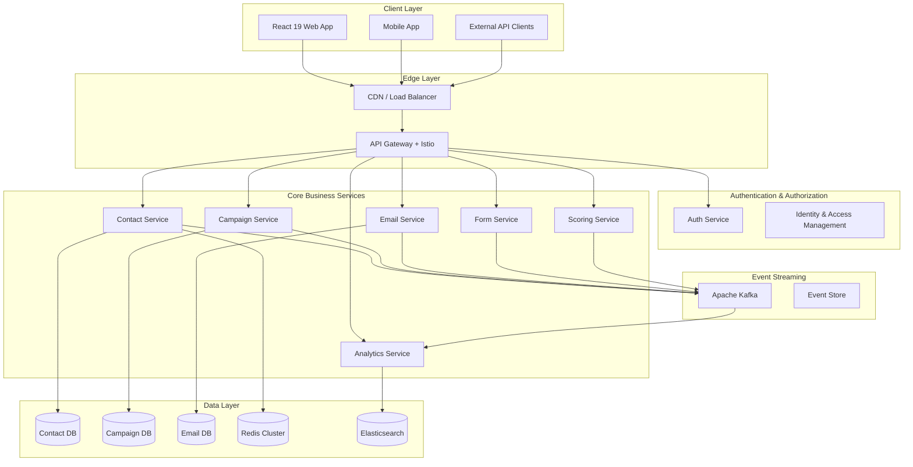
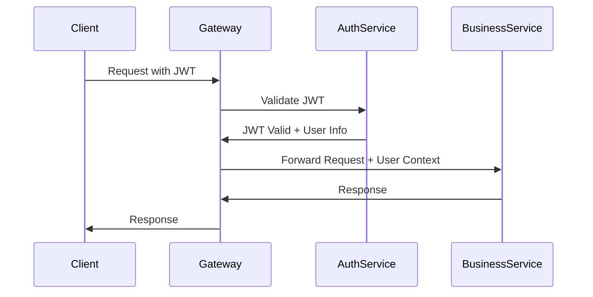

# System Design

GripDay implements a **microservices-first architecture** designed for enterprise-scale B2B marketing automation. The system prioritizes scalability, maintainability, and operational simplicity while supporting complex business workflows.

## 🎯 Architecture Principles

### Core Design Principles

- **Microservices Independence**: Each service operates independently with dedicated resources
- **Domain-Driven Design**: Services organized around business domains and bounded contexts
- **Event-Driven Communication**: Asynchronous inter-service communication via message streaming
- **API-First Design**: Well-defined REST APIs with comprehensive OpenAPI documentation
- **Cloud-Native**: Kubernetes-native deployment with service mesh integration
- **Multi-Tenant Ready**: Complete tenant isolation at service and data levels

### Strategic Objectives

- **Scalability**: Independent horizontal scaling of individual services
- **Reliability**: Fault isolation and graceful degradation
- **Maintainability**: Clear service boundaries and responsibilities
- **Performance**: Optimized for high-throughput B2B operations
- **Security**: Multi-layered security with zero-trust architecture

## 🏗️ High-Level Architecture



## 🔧 Core Components

### API Gateway

**Technology**: Spring Cloud Gateway with Istio Service Mesh

**Responsibilities**:

- Intelligent routing with path-based and header-based routing
- JWT authentication integration with Auth Service
- Redis-based rate limiting per tenant and endpoint
- Circuit breaker pattern with Resilience4j
- CORS support for frontend integration
- Request/response filtering and security headers
- Distributed tracing with OpenTelemetry

**Key Features**:

```java
@Configuration
public class GatewayConfig {
    @Bean
    public RouteLocator customRouteLocator(RouteLocatorBuilder builder) {
        return builder.routes()
            .route("contact-service", r -> r.path("/api/v1/contacts/**")
                .filters(f -> f
                    .requestRateLimiter(c -> c.setRateLimiter(redisRateLimiter()))
                    .circuitBreaker(c -> c.setName("contact-service-cb"))
                    .addRequestHeader("X-Tenant-ID", "#{@tenantResolver.resolve(#exchange)}"))
                .uri("lb://contact-service"))
            .build();
    }
}
```

### Authentication Service

**Technology**: Spring Boot 3 with Spring Security 6

**Responsibilities**:

- JWT token creation, validation, and refresh
- User registration, authentication, and profile management
- Role-based access control (RBAC) with granular permissions
- Security audit logging and user activity monitoring
- Service-to-service authentication

**Database Schema**:

```sql
-- Users table with tenant isolation
CREATE TABLE users (
    id BIGSERIAL PRIMARY KEY,
    username VARCHAR(50) UNIQUE NOT NULL,
    email VARCHAR(100) UNIQUE NOT NULL,
    password_hash VARCHAR(255) NOT NULL,
    tenant_id VARCHAR(50) NOT NULL,
    active BOOLEAN DEFAULT true,
    created_at TIMESTAMP DEFAULT CURRENT_TIMESTAMP,
    updated_at TIMESTAMP DEFAULT CURRENT_TIMESTAMP
);

-- Roles and permissions
CREATE TABLE roles (
    id BIGSERIAL PRIMARY KEY,
    name VARCHAR(50) UNIQUE NOT NULL,
    description TEXT
);

CREATE TABLE user_roles (
    user_id BIGINT REFERENCES users(id),
    role_id BIGINT REFERENCES roles(id),
    PRIMARY KEY (user_id, role_id)
);
```

### Contact Management Service

**Technology**: Spring Boot 3 with JPA/Hibernate

**Responsibilities**:

- Contact and company CRUD operations
- Advanced search and filtering with Elasticsearch
- Contact segmentation and filtering
- Activity tracking and timeline management
- CSV import/export with validation
- Contact deduplication with configurable rules

**Core Entities**:

```java
@Entity
@Table(name = "contacts")
public class Contact {
    @Id
    @GeneratedValue(strategy = GenerationType.IDENTITY)
    private Long id;

    private String firstName;
    private String lastName;
    private String email;
    private String phone;

    @ManyToOne
    @JoinColumn(name = "company_id")
    private Company company;

    @Column(name = "tenant_id")
    private String tenantId;

    @CreationTimestamp
    private LocalDateTime createdAt;

    @UpdateTimestamp
    private LocalDateTime updatedAt;
}
```

### Email Marketing Service

**Technology**: Spring Boot 3 with multi-provider SMTP integration

**Responsibilities**:

- Email template management and rendering
- Multi-provider SMTP delivery (SendGrid, Mailjet, Amazon SES)
- Comprehensive email tracking (opens, clicks, bounces, unsubscribes)
- Email personalization with token replacement
- Email queue processing with Kafka
- Bounce management and IMAP monitoring

**Email Processing Pipeline**:

```java
@Service
public class EmailDeliveryService {

    @KafkaListener(topics = "email.send.requests")
    public void processEmailSendRequest(EmailSendRequest request) {
        // 1. Validate email content and recipients
        // 2. Apply personalization and token replacement
        // 3. Select optimal SMTP provider
        // 4. Send email with tracking pixels
        // 5. Publish delivery events to Kafka
    }
}
```

### Campaign Automation Service

**Technology**: Spring Boot 3 with workflow engine

**Responsibilities**:

- Workflow engine with step-by-step processing
- Campaign trigger system for various event types
- Campaign action handlers (email, wait, condition, segment)
- Conditional logic engine with complex branching
- Campaign analytics and performance tracking
- Real-time campaign execution via Kafka events

**Workflow Engine**:

```java
@Component
public class CampaignWorkflowEngine {

    @Async
    public CompletableFuture<Void> processContact(Long campaignId, Long contactId) {
        Campaign campaign = campaignRepository.findById(campaignId);
        Contact contact = contactService.findById(contactId);

        // Execute workflow steps
        for (WorkflowStep step : campaign.getWorkflowSteps()) {
            executeStep(step, contact);
        }

        return CompletableFuture.completedFuture(null);
    }
}
```

## 🔄 Communication Patterns

### Synchronous Communication (REST APIs)

- **Client-to-Gateway**: HTTP/REST with JWT authentication
- **Gateway-to-Services**: Load-balanced HTTP with circuit breakers
- **Service-to-Service**: Direct HTTP calls for immediate responses
- **Error Handling**: Consistent error responses with proper HTTP status codes

### Asynchronous Communication (Event-Driven)

- **Event Streaming**: Apache Kafka with partitioned topics
- **Event Types**: Domain events (contact.created, email.sent, campaign.triggered)
- **Event Consumers**: Services subscribe to relevant events with filtering
- **Event Sourcing**: Complete audit trail with event replay capabilities

**Event Publishing Example**:

```java
@Component
public class ContactEventPublisher {

    private final KafkaTemplate<String, Object> kafkaTemplate;

    public void publishContactCreated(Contact contact) {
        ContactCreatedEvent event = ContactCreatedEvent.builder()
            .contactId(contact.getId())
            .tenantId(contact.getTenantId())
            .email(contact.getEmail())
            .timestamp(Instant.now())
            .build();

        kafkaTemplate.send("contact.created", event);
    }
}
```

## 🗄️ Data Architecture

### Database-per-Service Pattern

Each microservice maintains its own dedicated PostgreSQL database:

- **Auth Service DB**: Users, roles, permissions, sessions
- **Contact Service DB**: Contacts, companies, activities, imports
- **Email Service DB**: Templates, campaigns, tracking, deliveries
- **Campaign Service DB**: Workflows, triggers, executions
- **Form Service DB**: Forms, fields, submissions, analytics
- **Scoring Service DB**: Scores, rules, behaviors, models
- **Analytics Service DB**: Reports, dashboards, metrics, aggregates

### Shared Infrastructure

- **Redis Cluster**: Caching, sessions, rate limiting, temporary data
- **Elasticsearch**: Advanced search, analytics, centralized logging
- **MinIO/S3**: File storage for assets, uploads, backups

### Data Consistency

- **Eventual Consistency**: Via event-driven architecture
- **Saga Pattern**: For distributed transactions
- **Event Sourcing**: Complete audit trail and data recovery

## 🔒 Security Architecture

### Multi-Layer Security

1. **Network Security**: Istio mTLS, Network Policies, Pod Security Standards
2. **Application Security**: JWT authentication, RBAC, input validation
3. **Data Security**: Encryption at rest and in transit, secret management

### Authentication Flow



## 📊 Performance & Scalability

### Performance Targets

- **API Response Time**: < 200ms (95th percentile)
- **Email Processing**: 10,000 emails/hour
- **Contact Import**: 100,000 contacts/hour
- **Concurrent Users**: 10,000 active users
- **System Uptime**: 99.9%

### Scaling Strategies

- **Horizontal Scaling**: Kubernetes HPA for individual services
- **Database Scaling**: Read replicas and connection pooling
- **Cache Scaling**: Redis cluster with automatic failover
- **Event Streaming**: Kafka partitioning for parallel processing

### Monitoring & Observability

- **Metrics**: Prometheus with custom business metrics
- **Tracing**: Jaeger for distributed request tracing
- **Logging**: ELK Stack for centralized log analysis
- **Alerting**: Alertmanager with intelligent escalation

## 🚀 Deployment Architecture

### Kubernetes-Native Deployment

- **Container Orchestration**: Kubernetes with Helm charts
- **Service Mesh**: Istio for traffic management and security
- **GitOps**: ArgoCD for automated deployment and rollbacks
- **Operators**: CloudNativePG for PostgreSQL, Strimzi for Kafka

### Environment Strategy

- **Development**: Docker Compose for rapid development
- **Staging**: Minikube for Kubernetes testing
- **Production**: Cloud Kubernetes with multi-zone deployment

## 📚 Next Steps

1. **[Microservices Details](/architecture/microservices)** - Deep dive into individual services
2. **[Database Design](/architecture/database)** - Data modeling and relationships
3. **[Security Architecture](/architecture/security)** - Comprehensive security model
4. **[Deployment Guide](/architecture/deployment)** - Production deployment strategies

---

_This system design provides the foundation for a scalable, maintainable, and secure B2B marketing automation platform that can grow from startup to enterprise scale._
